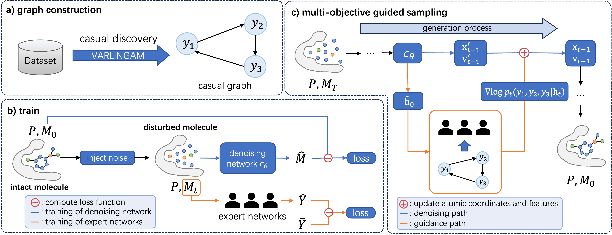

# MoC
🚀 Implementation for our paper [Multi-Objective Structure-Based Drug Design Using Causal Discovery](https://ieeexplore.ieee.org/abstract/document/11008440).




### 🧩 Environment
The environment configuration is the same as that of [KGDiff](https://github.com/CMACH508/KGDiff).

### 📊 Datasets
The preprocessed data is provided on [Google Drive](https://drive.google.com/drive/folders/1xuDsZ3ieboiAwmucCMl-g4zuVY9u2np4?usp=sharing). To train the model you need to download the preprocessed lmdb file and the split file:
* crossdocked_v1.1_rmsd1.0_pocket10_processed_final_with_all_property.lmdb
* crossdocked_pocket10_pose_split_all_property.pt

and place them in the ```./data ``` directory. The original protein pocket files are also included in a ZIP archive (crossdocked_v1.1_rmsd1.0_pocket10.zip).

### 📄 Pretrained Models

Download the pretrained model (checkpoint.pt) from [Google Drive](https://drive.google.com/drive/folders/1xuDsZ3ieboiAwmucCMl-g4zuVY9u2np4?usp=sharing) and place it in the ```./pretrained_models ``` directory.

### 🛠️ Training

```bash
cd MoC
python scripts/train_diffusion_joint.py
```

### ⚙️ Sampling

Here, we provide two examples for molecule generation.


-   To sample molecules for the test set in CrossDocked2020:
    ```bash
    python scripts/sample_diffusion_multi.py --config ./configs/sampling.yml --result_path ./outputs -i {i} # Replace {i} with the index of the data. i should be between 0 and 99 for the testset.
    ```

-   To sample molecules from a given protein pocket:
    ```bash
    python scripts/sample_diffusion_multi_for_pocket.py --pdb_path {pdb_path} # Replace {pdb_path} with the path of a given .pdb file.
    ```

### ⚖️ Evaluating

```bash
python scripts/evaluate_diffusion.py --sample_path ./outputs
```
Our results are provided in the [results](https://drive.google.com/drive/folders/1FOHXw1wOsFuGrJBzxiyWhyO0wctxnxXY?usp=sharing) Google Drive folder.

### 📜 Citation
```
@article{zhou2025multi,
  title={Multi-Objective Structure-Based Drug Design Using Causal Discovery},
  author={Zhou, Jingyuan and Zhao, Dengwei and Qian, Hao and Tu, Shikui and Xu, Lei},
  journal={IEEE Transactions on Computational Biology and Bioinformatics},
  year={2025},
  publisher={IEEE}
}
```
